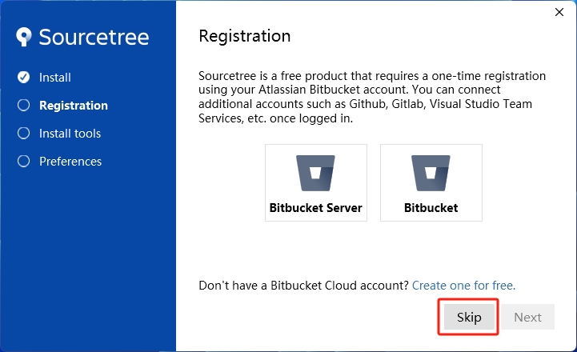
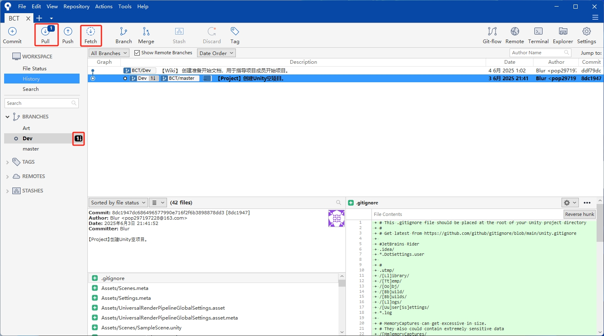
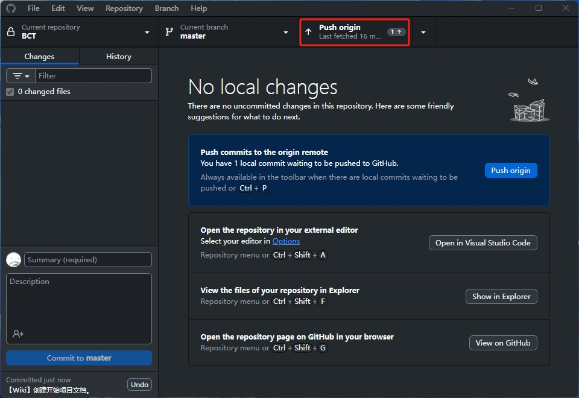

<h1 align="center"> 使用 Git 管理项目</h1>

## 简介
此文档介绍如何使用 Git 来管理项目版本，使用 GitHub 来托管项目仓库。\
以及使用 Git 图形化客户端来进行各种 Git 操作。

## 关于 Git
Git 是一个分布式版本控制系统，用于跟踪文件的更改，特别适用于管理源代码。\
它允许团队开发时，每个成员并行开发工作，最后将工作成果合并后作为最终的工作成果。

### 分支
Git 是基于分支进行项目管理的。\
了解分支有注意你处理多人开发时，不同工作内容的平行开发，合并，并更新内容到 master 分支。\
如果你想了解更多关于分支的内容，可以阅读[菜鸟教程 Git 分支管理](https://www.runoob.com/git/git-branch.html)的文章。

## 关于 Git 仓库
Git 本身只提供了版本管理的功能。我们还需要在远端仓库托管你的项目。\
你可以自建服务器来托管，或者使用 [GitHub](https://github.com/) 这样的免费代码仓库托管平台。\
在示例中，我们使用GitHub来托管仓库。

## 关于 Git 操作方式
使用 Git 从的方式有很多，你可以直接使用 Git Bash 通过命令行来拉取项目。\
或者使用免费的 Git 的图形化客户端，比如 [Sourcetree](https://www.sourcetreeapp.com/) 或者 [GitHub Desktop](https://desktop.github.com/download/) 来进行Git的操作。\
其他像是 [Fork](https://git-fork.com/) 或者 [GitKraken](https://www.gitkraken.com/) 也是非常不错的选择，但这两个工具有免费和收费策略。

## 安装 Git
首先你需要从 https://git-scm.com/downloads 下载 Git。\
选择对应的版本并下载 Git 安装包。

点击安装包，并按步骤安装 Git。

安装完成后，你可以直接通过 Git Bash 使用命令行来拉取项目。\

## 使用 Sourcetree
Sourcetree 的界面相对复杂一些，但提供来更大的可操作性。\
可视化的 Git 分支树方便了多分支的处理。\
推荐使用，因为你可能需要在 Git 分支遇到问题时需要处理。\
如果你不想使用复杂的命令行，Sourcetree 是最好的选择，他提供了很多常用的 Git 操作，基本能解决遇到的各种Git相关问题。\
当然他也有自己的问题，在预览代码过多或者操作内容过多时会卡顿，此时推荐直接使用 IDE 的 Git 工具或使用 Git Bash 来操作。
打开 https://www.sourcetreeapp.com/ 并下载 Sourcetree 安装包。

按步骤安装 Sourcetree。

跳过登陆 Bitbucket 步骤。

必要软件的安装，如果没有会自动下载。

设置你的 GitHub 邮箱到此处。

不读取 SSH Key 。因为我们直接使用 HTTPS 来克隆项目。

安装完成后会自动启动 Sourcetree ，点击 Clone 进行克隆。\
填写我们 GitHub 项目的链接。并选择本地文件夹位置。

从 GitHub 复制你项目的链接。

等待项目拉取完成后。左侧确认当前所在的分支。\
双击一个分支就能切换到目标分支。\

## 使用注意
关于流程，我们改变的工作内容需要现在本地创建 Commit 提交。然后再将本地 Commit 推送到源项目（GitHub库）。\
理论情况下，我们当前改变的工作内容都应当现在自己的工作分支提交，比如 Dev 开发分支或 Art 美术分支。\
而不是直接推送到 master。\
当我们确定 Dev 或 Art 分支没有问题后，再由开发负责人合并到 master 分支。

## 项目的更新
我们每次启动项目时，都应当先确认源项目（GitHub库）是否有更新。\
点击 Fetch 来获取更新，然后点击 Pull 来拉取源项目到本地。

## 上传更改的内容
当我们完成一个阶段的工作后，我们需要创建 Commit 来保存，并推送更新到源项目（GitHub）。\
我们不应该在长时间工作后，将大量的工作作为一个 Commit 一次性提交，这样不利于项目维护。\

当我们有改变的内容后，点击左上角菜单栏的 Commit 来切换到提交页面。\
我们可以看到当前产生的有变化或新增的文件。 

我们需要先点击 Stage All 将所有的变更推送到上方的阶段性文件，然后输入标题，并点击右下角的 Commit 来创建一个提交。\
我们也可以按需选择要提交的文件，不提交的保持在下方的框内。

提交 Commit 后，更改还只存在于本地，我们需要点击 Push 将更改推送到源项目（GitHub库）。

## 使用 GitHub Desktop
GitHub Desktop 的界面简洁，简单易用。\
但他没有提供可视化分支树。\
打开 https://desktop.github.com/download/ 并下载 GitHub Desktop。

登陆你的 GitHub 账户。

继续并授权登陆。

设置名称和邮箱并点击 Finish 完成设置。

搜索 BCT 项目，并点击选择搜索到的项目，再点击 Clone 按钮将项目克隆到本地。

设置项目本地文件夹位置，并点击 Clone 开始克隆项目。

等待项目克隆完成。

## 项目的更新
每次开始工作前，都应该确认源（GitHub库）项目是否有更新。\
点击 Fetch origin 来获取源项目。\
如果源项目有更新，点击 Pull 来拉取项目更新的 Commit 内容到本地。

TODO：配图。

## 上传更改的内容
在完成一个阶段的工作后，创建 Commit 并推送到源（更新到GitHub库）。

这是主界面。上方是菜单，左侧是修改的内容，右侧是内容预览。\
当完成工作后，我们先需要进行Commit来提交改变的内容。\
在左侧通过打钩√来确认哪些内容是需要提交的。\
然后输入本次 Commit 的标题和描述。之后点击 Commit 创建一个本地的提交。

创建Commit后，改变的内容仅仅存在于本地，我们还需要将Commit推送到源项目（GitHub库）。\
当本地有新的Commit时，Push origin 按钮会出现。点击上方菜单中的 Push origin 按钮来推送本地的Commit到源项目（GitHub库）。

