# 【安装Unity】
## 第一步，安装UnityHub。
从 https://unity.com/download 下载UnityHub并安装。

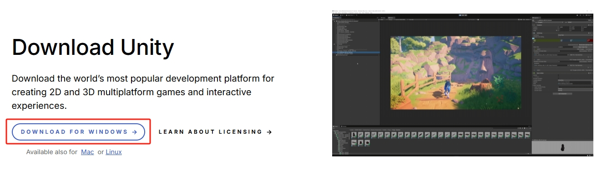

打开安装包。
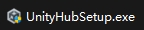

按步骤逐步进行安装。

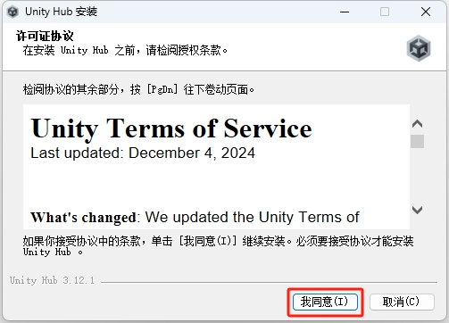
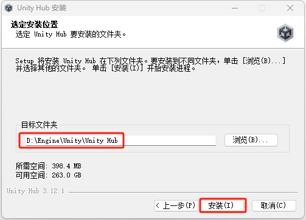

## 第二步，打开UnityHub注册并登陆。

打开安装好的Unity并注册一个账号。

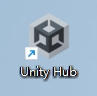

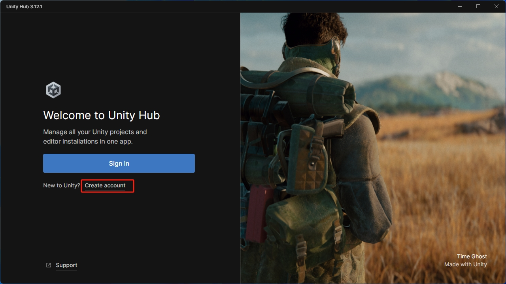

输入邮箱并继续。

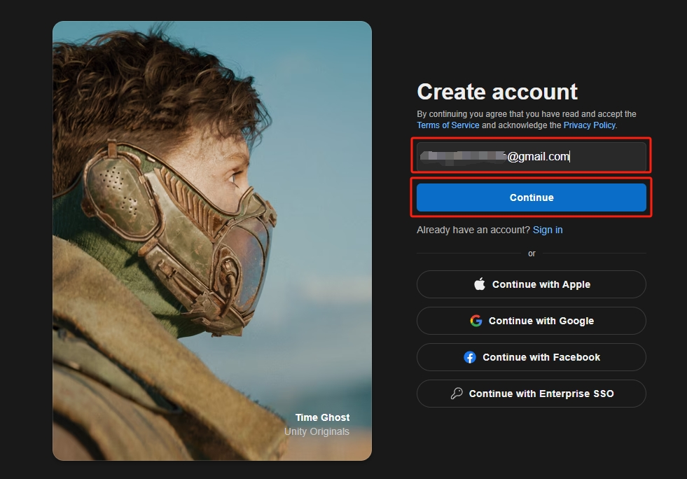

输入用户名、全名和密码后继续。

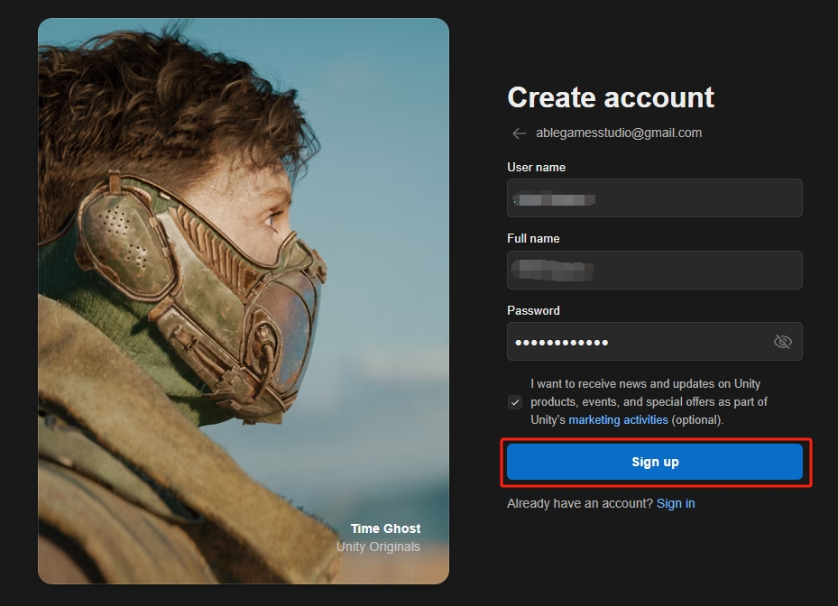

这里Unity发送了一封确认邮件到你的邮箱，不用点继续，去邮箱点确认链接。

找到对应邮件打开，点击链接。

链接会直接打开登陆界面，到这已经注册成功了。输入邮箱账号并继续。

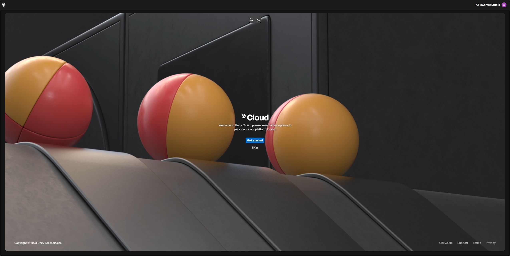

网页登陆好后先不用管，打开UnityHub界面，并点击登陆。

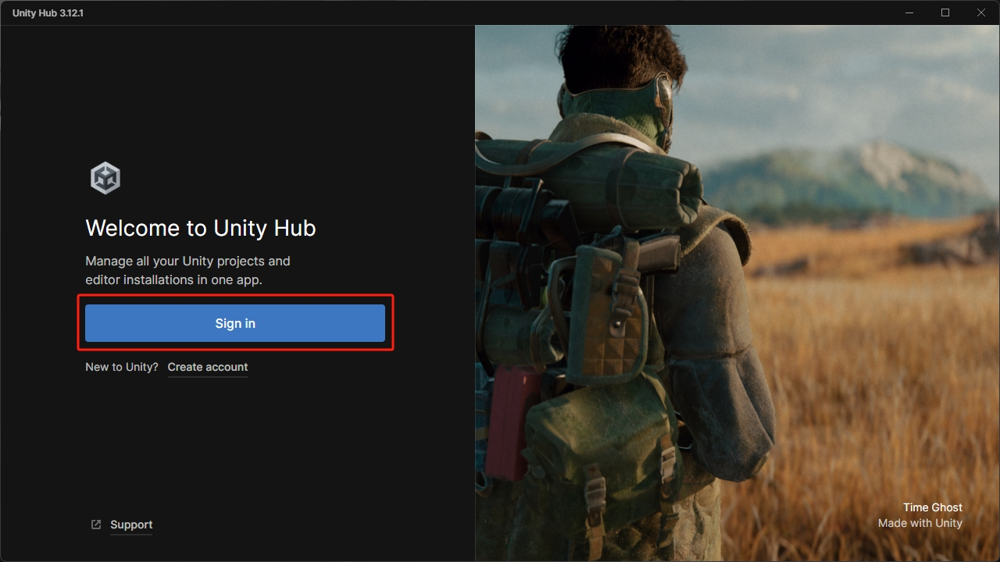

之后网页的Unity的账户界面会弹出登陆授权提示，点击打开。

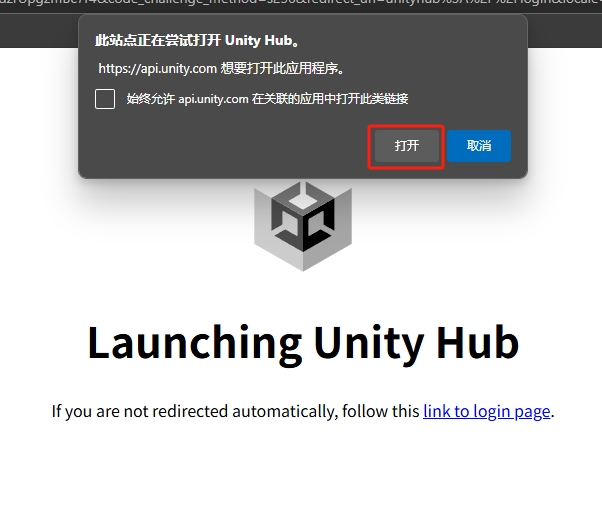

UnityHub登陆后，会默认给你发放个人证书用于个人开发。点击同意。

## 第三步，添加项目和安装引擎。

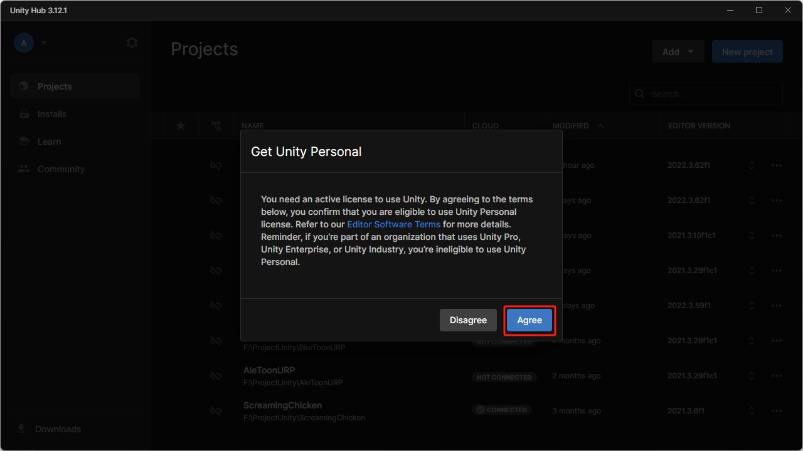

添加本地项目到UnityHub。（请确保你已经从GitHub拉取了项目）

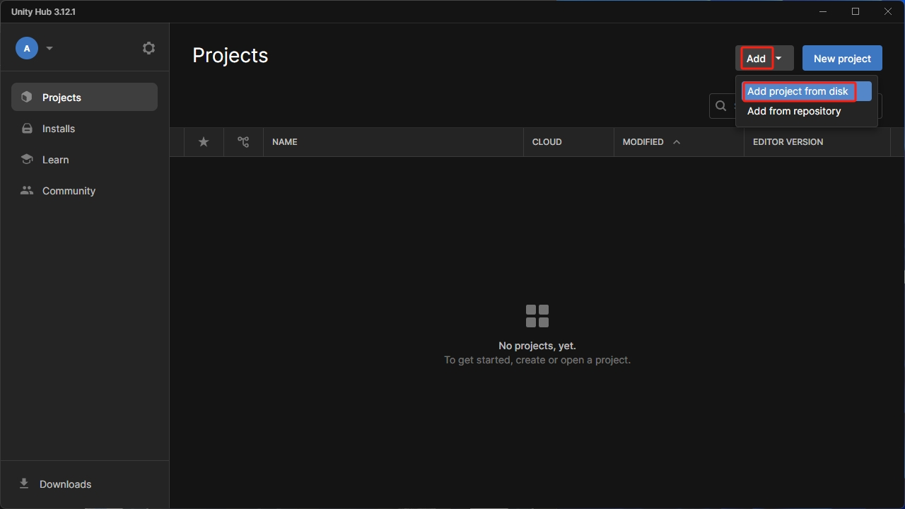

打开对应项目文件夹，并点击Open。此时项目已经添加到UnityHub，但可能提示你还未安装对应版本的Unity引擎。

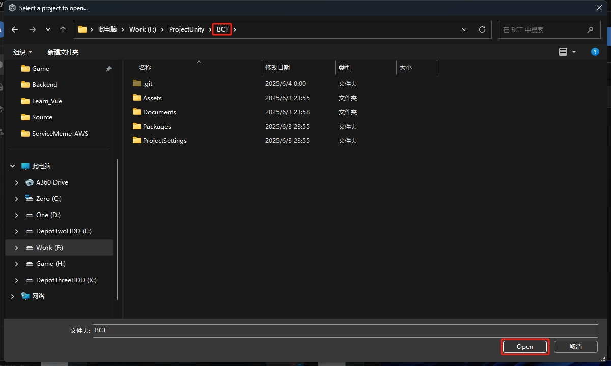

点击Installs后会显示已经安装的Unity引擎列表。点击右上角InstallEditor安装引擎。

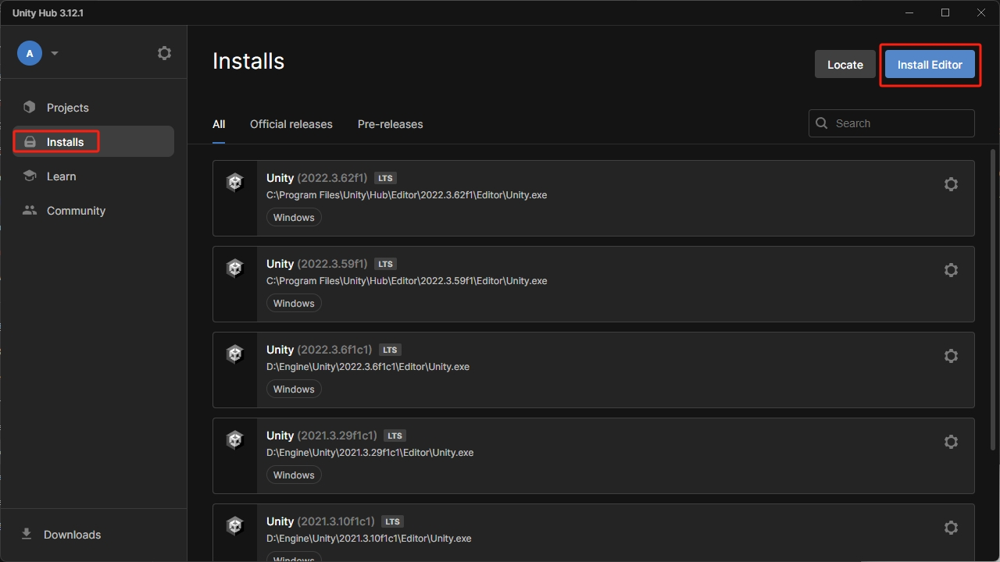

此项目需要的版本是`Unity2022.3.62f1`，如果在列表中请直接点击Install下载。
（列表中只会显示最新的LTS版本，没有往后看去Archive下载。）

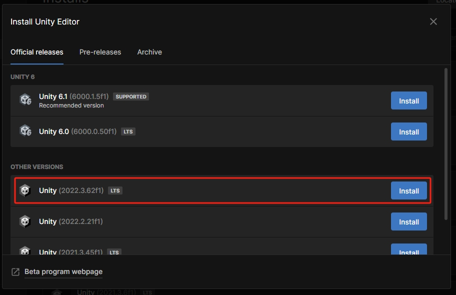
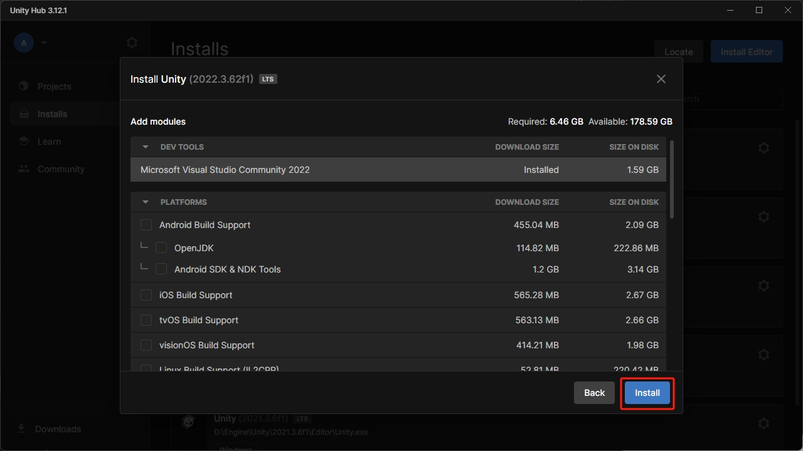

如果需要的版本不是当前最新的LTS版本，点击 Archive 后，点击 download archive 打开Unity引擎档案库网页。

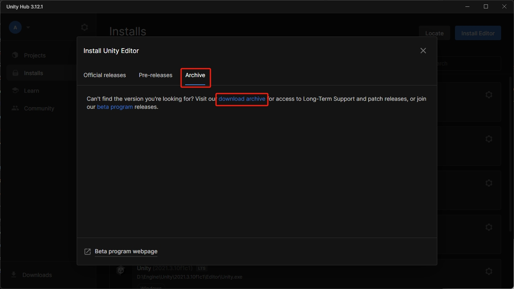

选择需要的版本并点击 INSTALL 下载。

等待引擎下载完成。

## 第四步，启动项目。

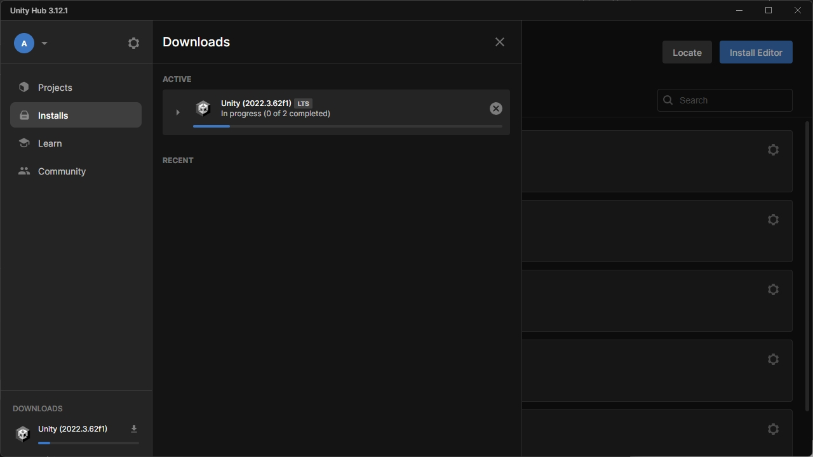

完成后，直接在UnityHub界面打开

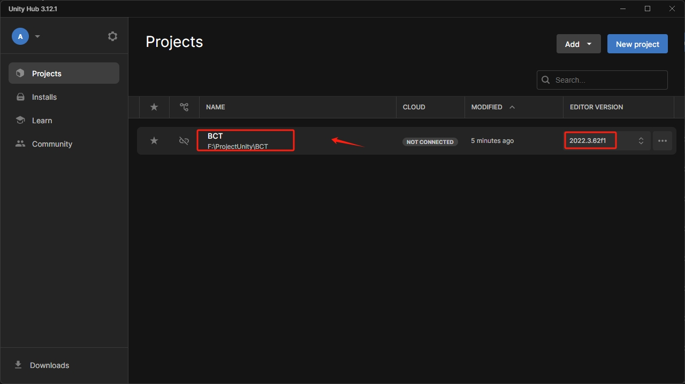

如果是第一次打开项目，启动会需要一些时间。

终于！项目打开了！

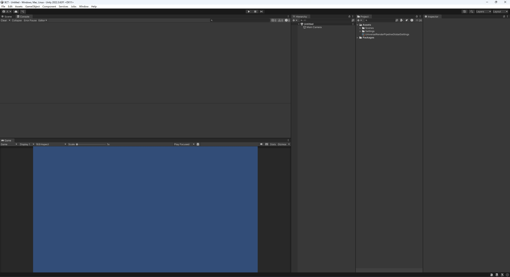